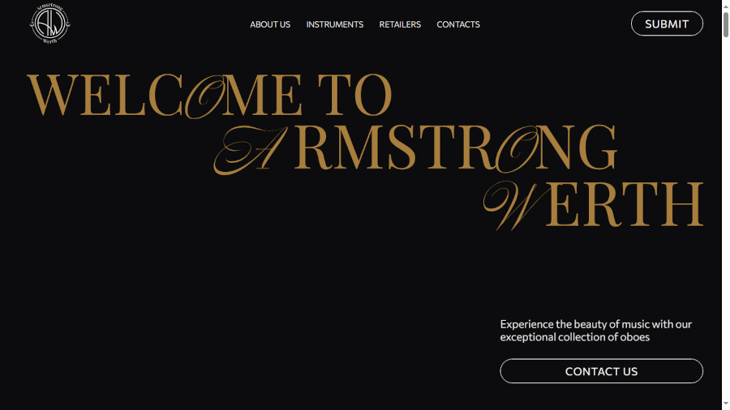
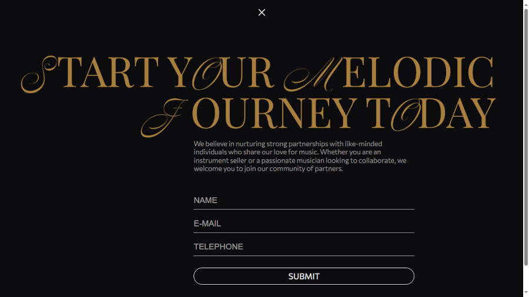

# Armstrong Werth website

This repository contains the source code for a landing page of a musical instruments sales website.

## Overview

This website serves as a brochure-style platform for showcasing musical instruments, providing detailed information about available products, links to distributors, and a contact form for inquiries. The goal of the website is to attract potential customers and facilitated communication with distributors.

## Screenshots

<!-- <details>
  <summary>Click to expand!</summary>

      
</details> -->
<div style="display: flex; overflow-x: auto; max-width: 100%; gap: 10px;">
  
  
  
  
  
</div>

## Technologies Used

- HTML: Markup language for structuring web pages.
- CSS: Stylesheet language for styling web pages.
- JavaScript: Programming language used for interactive elements and animations.
- GreenSock Animation Platform (GSAP): JavaScript library for creating advanced animations.
- PHP: Server-side scripting language used for form handling and backend interactions.

## Usage

To view the website locally, make sure you have Git installed on your computer. Then, clone this repository and open the `index.html` file in your web browser.

```bash
git clone https://github.com/DarkDomian/darkdomian.github.io.git AW-website
```

Alternatively, you can visit the live website using the following [link](new.aw-oboe.com.au).

## Structure

- `index.html`: Main landing page of the website.
- `style.css`: Stylesheet for defining the visual appearance of web pages.
- `main.js`: JavaScript file containing scripts for interactive elements.
- `img/`: Folder containing image assets used in the website.
- `mail.php`: PHP script for handling the feedback form.

## Contacts

For inquiries or feedback, feel free to contact me at [darkdomian@gmail.com](mailto:darkdomian@gmail.com).
You can also find me on [Instagram](https://www.instagram.com/darkdomian) or [Telegram](https://t.me/DarkVib) for more interaction.